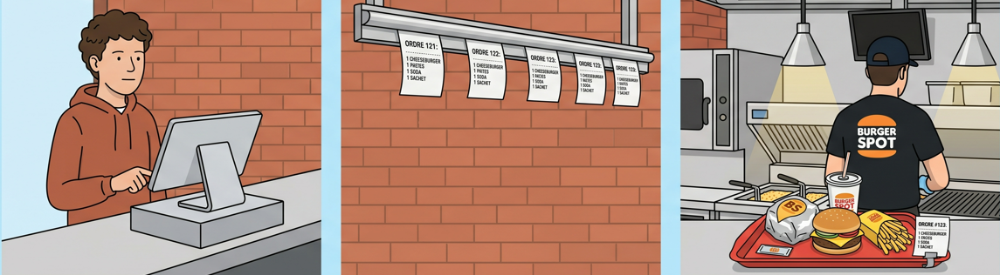

<!-- _class: lead -->
<!-- _backgroundColor: #1D3557 -->
<!-- _color: white -->

# LabVIEW Embedded Course
## 👋 Welcome

---

## 🎯 The course, at a glance

- 6 sessions, **one running project**, growing every week
- Project: building an "acquire and process" application for **NI MyRIO**
- Talk about
  - LabVIEW Real-Time constraints
  - Software architecture and modular development
  - GitHub

---

## 📊 The evaluation

- Evaluation: the project itself, on the final commit — no written exam
- Criteria:
  - Style (names, icons, aligned objects, code readability...)
  - Functionality (the code works)
  - Documentation (within the code)
  - Assiduity

---

<!-- _class: lead -->
<!-- _backgroundColor: #1D3557 -->
<!-- _color: white -->

# 1️⃣ Session 1
## Separation of Concerns & Producer/Consumer

---

## Today's plan *(relative to your session start)*

| Elapsed | Block |
|---|---|
| 0:00–0:15 | Welcome, storyline, target architecture |
| 0:15–0:30 | Project setup: `.lvproj` + GitHub |
| 0:30–1:15 | Concept 1 — The Producer/Consumer pattern |
| 1:15–2:00 | Work 1 — Take Order & Cook and Serve |
| 2:00–2:15 | Break |
| 2:15–3:00 | Concept 2 — The generic module contract |
| 3:00–4:00 | Work 2 — Opening the restaurant |

---

## 🛠️ Project setup, before any code

1. Empty GitHub repo, private, connected in **Fork**
2. `.gitignore` for LabVIEW (`*.aliases`, `*.lvlps`, `builds/`, `~*.vi`…)
3. Create **`LVEmbeddedCourse.lvproj`** — a neutral, real project name
4. Two auto-populating folders: `/sandbox` and `/src`
5. First commit: *"Initial commit — project structure"*

✅ **Checkpoint**: repo + `.lvproj` + first commit, before we touch a block diagram

---

<!-- _class: lead -->
<!-- _backgroundColor: #1D3557 -->
<!-- _color: white -->

# 🧩 Concept 1
## The Producer/Consumer pattern

---

## 🍔 LV-King, day one

One employee does everything, one customer at a time:

**take the order** → then **cook and serve** it

The next customer can't even order until the first one is fully served.

---

## 👀 Live demo (instructor-led)

- Single While Loop: `Wait 500 ms` (take order) → cook and serve:
  **100 ms nine times out of ten, 1000 ms one time out of ten**
- Run ~30 seconds
- Watch the slow cook: **the next customer waits for the whole thing**
  before they can even place *their* order

> Is that fair? What's actually causing the wait?

---

## 🧩 Naming the problem

**Temporal coupling**

As long as taking the order and cooking share one flow of execution,
a slowdown anywhere blocks *everything* else in it —
even parts that have nothing to do with the slowdown.

---

## 💡 The fix: producer / consumer

- **Take Order** (producer) — steady pace, drops slips into a **tray**
- **Cook and Serve** (consumer) — picks from the tray at its own pace

An occasional slow cook no longer blocks Take Order at all. The tray briefly holds 1–2 extra slips, then drains back to zero.

**This is called the producer/consumer pattern.**

---

## ⚠️ Pay attention

This only works because Cook and Serve is fast **on average**.

Two use cases:
- the consumer is much faster than the producer
- the consumer works by packets

**Question**: what happens if the consumer is slower than the producer?

---

## 🧰 Building the tray with LabVIEW: Queues

| Function | Role |
|---|---|
| `Obtain Queue` | create/get a reference to a named queue |
| `Enqueue Element` | drop an item in *(Take Order)* |
| `Dequeue Element` | pick an item out, with a timeout *(Cook and Serve)* |
| `Release Queue` | release when done |

---

<!-- _class: lead -->
<!-- _backgroundColor: #1D3557 -->
<!-- _color: white -->

# 🛠️ Work 1
## Take Order & Cook and Serve

`/sandbox/work1_take_order_cook_serve.vi`

---

## 🛠️ Work 1 — build it

0. **Create a new VI**: `/sandbox/work1_take_order_cook_serve.vi`
1. `Obtain Queue` (`"Tray"`, type U32 `order_id`)
2. **Take Order loop**: fixed 500 ms, `Enqueue Element`
3. **Cook and Serve loop**: `Dequeue Element`, wait 100/1000 ms with probability 1/10
4. Count and display the served clients on a chart
5. Global STOP, clean shutdown, `Release Queue`
6. **Watch the tray size**: show the number of elements in the queue

---

## 🔬 Work 1 — experiment

- Push the slow-cook probability to 4/10, then 5/10 → watch the tray size
- Try to explain mathematically what's happening

✅ **Commit**: `"Work 1 - producer/consumer pattern (sandbox)"`

---

<!-- _class: lead -->
<!-- _backgroundColor: #1D3557 -->
<!-- _color: white -->

# 🧩 Concept 2
## The generic module contract
### And the separation of concerns

---

## 🧩 One module, one responsibility

To have our restaurant working well, we want each employee to have a limited, well-defined role. That's **separation of concerns**.

| Restaurant | LabVIEW |
|---|---|
| Employee | Module |
| Listens to its superior | Is a `consumer` |
| Understands spoken orders | Dequeues cluster messages `{command: string, payload: string}` |

---

## 📜 One module, a well-defined contract

A module defines clearly what it can do — the list of commands it understands and executes.

Example, an employee introducing themselves:

*"I'm the drinks manager. The orders I understand are:"*
- `{command: "Clean the desk", payload: ""}`
- `{command: "Serve Coke", payload: "Small/Medium/Big"}`
- `{command: "Refill the machine", payload: ""}`

⇨ That's the module contract. Whoever uses this module should **never** send it a command outside this list — don't ask the drinks manager to cook a steak.

---

## 🏗️ The application, a modules ecosystem

- A restaurant is a group of employees working together, in a hierarchy
- Our application is a group of modules communicating together
- One **manager module** talks to several **worker modules**

---

<!-- _class: lead -->
<!-- _backgroundColor: #1D3557 -->
<!-- _color: white -->

# 🛠️ Work 2
## Opening the restaurant

`/sandbox/work2_cooker_draft_module.vi`

---

## 🎯 The challenge

In this new VI representing our restaurant, we want a main module, the Cooker, handling the following contract:
- `{command: "Stop", payload: ""}`: closes the restaurant (stops the loop)
- `{command: "Cook burgers", payload: "quantity"}`: prepares burgers (short wait, wrapped in a For Loop)
- `{command: "Cook a meal", payload: ""}`: prepares a full meal (long wait)

Another loop plays the order taker — not built as a module yet, just used to send commands to the Cooker.

---

## 🛠️ Build it

1. Queue element `cluster = {command: string, payload: string}`
2. **The Cooker**: `Obtain Queue` + While Loop with `Dequeue` inside a case structure + `Release Queue` after the loop
3. **Get Order**: read HMI buttons to send "Stop", "Cook burgers", or "Cook a meal"
4. Test: place orders live, STOP shuts down cleanly

✅ **Commit**: `"Skeleton: Cooker (generic contract)"`, push

---

## 📦 Deliverables today

- `.gitignore`, `LVEmbeddedCourse.lvproj` (`/src`, `/sandbox`)
- Work 1 and Work 2 in `/sandbox`

---

<!-- _class: lead -->
<!-- _backgroundColor: #1D3557 -->
<!-- _color: white -->

## 🔜 Next week

- Cooker gets refactored
- Order Taker moves into its own real, reusable file
- A new station opens: the logbook
- And we open our first Git branches — **no more testing a new recipe directly on the official menu.**
