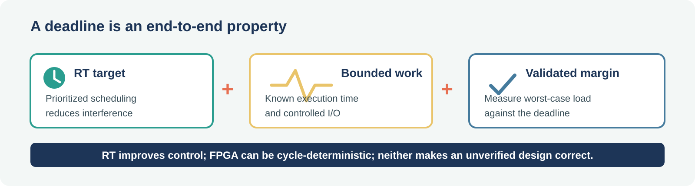
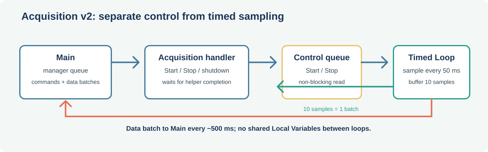

<!-- _class: lead -->
<!-- _backgroundColor: #1D3557 -->
<!-- _color: white -->

# 3️⃣ Session 3
## The reveal: it was never a restaurant

---

## Today's plan *(relative to your session start)*

| Elapsed | Block |
|---|---|
| 0:00–0:10 | Welcome |
| 0:10–0:55 | Concept 1 — Determinism, jitter, Timed Loop |
| 0:55–1:40 | Work 1 — Build a jitter meter, try to break it |
| 1:40–1:55 | Break |
| 1:55–2:25 | Concept 2 — The reveal, and today's plan |
| 2:25–3:10 | Work 2 — Sequence diagram, then Acquisition v1 |
| 3:10–4:00 | Work 3 — Acquisition v2, wiring it into Main |

---

<!-- _class: lead -->
<!-- _backgroundColor: #1D3557 -->
<!-- _color: white -->

# 🧩 Concept 1
## Determinism, jitter, Timed Loop

---

## 🍟 The automated fryer problem

Frying is serious business: pull the basket too early, the fries are soggy — too late, they're burnt. It has to come out at **exactly 180 seconds**, every time.

Two options: an employee juggling ten other tasks lifts the basket whenever they get to it — or an automated fryer lifts it at a preprogrammed, guaranteed time.

**Determinism**: a guarantee that an action happens at a fixed point in time, regardless of what else is going on.

---

## 🧑‍🍳 The human vs. the machine

- **The employee is Windows** — capable, versatile, juggles a lot... but weak determinism
- **The automated fryer is LabVIEW Real-Time** — an OS built for one promise: strong determinism

---

## Why a normal PC struggles with this

Windows juggles dozens of processes.

Its scheduler treats priorities as **hints**, not guarantees.

A loop using `Wait (ms)` on a busy machine will drift.

---

## ⏱️ Timed Loop — what it buys you, and what it doesn't

| Target | What it provides |
|---|---|
| Real-Time target | Prioritized scheduling and more predictable timing; deadlines still depend on bounded code and load |
| FPGA | Cycle-deterministic execution when the design meets its timing and resource constraints |
| Plain Windows | Best-effort scheduling; no hard deadline guarantee |

---

## 👀 Live instructor demo

Timed Loop on sbRIO/myRIO, toggling a digital output at a fixed rate — rock-steady on a scope even under heavy load.

---

<!-- _class: lead -->
<!-- _backgroundColor: #1D3557 -->
<!-- _color: white -->

# 🛠️ Work 1
## Build a jitter meter, try to break it

`/sandbox/work3_jitter/`

---

## 🛠️ Build it

1. `JitterMeter.vi`: While Loop, `Wait (ms)` = 50 ms
2. `jitter = actual − target`, plotted, running min/max/mean
3. Idle baseline, ~30 s
4. **Real load**: one tight, `Wait`-free loop per CPU core
5. Convert to a Timed Loop, high priority, repeat

---

## 🔬 Be honest about the result, either way

- Jitter clearly increases → good, you've felt the problem
- Barely moves → also valid! Modern multi-core CPUs hide this well

**The point isn't "you should always see jitter" — it's "you got lucky this time, and luck is not a guarantee."**

---

<!-- _class: lead -->
<!-- _backgroundColor: #1D3557 -->
<!-- _color: white -->

# 🧩 Concept 2
## The reveal, and today's plan

---

## 🎭 It was never a restaurant

A central module that receives data and decides what to do with it, forwarding events to a logbook — and a module that produces data.

That's not a restaurant. That's a **real-time acquisition and processing system.**

From here, module and file names go technical — the comparisons stay, for explaining.

---

## 🔁 What actually changes today

Only one structural thing: **Get Order retires**, replaced by **Acquisition**.

Main doesn't split apart or get renamed again — same orchestration + business logic as always, just a new kind of logic to handle, in its own small sub-VI.

---

## 🎯 The two team missions

- **Group 1** *(Bio Med / Smart Energy)*: alert if the vibration gets too strong
- **Group 2** *(Embedded / Robotic)*: alert if the tray tilts too much

Full detail on each in Work 3, once Acquisition is actually producing data.

---

## 📐 Today's build plan, in three steps

1. **Sequence diagram first** — sketch the message flow before any code
2. **Acquisition v1** — simplest thing that works: one sample per message
3. **Acquisition v2** — hidden helper loop, batched samples

Each step built, tested standalone with its own Module Tester, and **committed separately**.

---

<!-- _class: lead -->
<!-- _backgroundColor: #1D3557 -->
<!-- _color: white -->

# 🛠️ Work 2
## Sequence diagram, then Acquisition v1

---

## ✍️ Step 1 — build a sequence-diagram VI

`AppSequenceDiagram.vi`: one vertical line per module (Acquisition, Main, Logbook), arrows for each message, in order.

Drop the **real module icons** on the block diagram, unwired — double-click to jump straight into the real code.

Lives in `/sandbox`, versioned with the code it describes.

---

## Step 2 — branch, write the v1 contract

`feature/acquisition-module`

Define `AccelSample.ctl = {x: DBL, y: DBL, z: DBL}` as a typedef, in `/src/types/`.

> *Can receive `"Stop"`, `"Start acquisition"` (payload: acquisition period in ms), `"Stop acquisition"`. While acquiring, at each period, sends `{"data", <AccelSample.ctl as Variant>}` to its caller.*

---

## 🛠️ Step 3 — build Acquisition v1

Follow **the recipe from Session 2** — folder, `.lvlib`, copy the template `Handler.vi` in, private data cluster.

- On `"Start acquisition"`: store the requested period, switch the `Dequeue` timeout to it *(the same trick Get Order used to poll its button — repurposed)*
- Timeout case → generate one simulated `AccelSample.ctl`, send `{"data", <sample>}`
- Build a `Module Tester.vi`, same pattern as Logbook's, and test standalone

✅ **Commit**: `"Acquisition v1 — single sample, timeout-driven (standalone, tested)"`

---

<!-- _class: lead -->
<!-- _backgroundColor: #1D3557 -->
<!-- _color: white -->

# 🛠️ Work 3
## Acquisition v2, wiring it into Main

---

## Refactor to v2

- New contract: `{"Data batch", <array of 10 AccelSample.ctl>}` every ~500 ms
- **Hidden helper Timed Loop** at 50 ms does the real sampling, batches 10
- A dedicated **control queue** carries Start/Stop/Shutdown from the Handler to the helper; the helper checks it without blocking each tick
- The helper owns its acquisition state and sends each batch directly to Main's queue; no shared Local Variables
- On shutdown, the Handler waits for the helper to finish before releasing queues

✅ **Commit**: `"Acquisition v2 — batched via hidden helper Timed Loop"`

> It's the automated fryer from this morning, tucked into its own station.

---

## Wire Acquisition into Main

- Remove Get Order's wiring, launch Acquisition instead
- `"Data batch"` → `ProcessDataBatch.vi` *(same sub-VI pattern as `HandleCookRequest.vi`)* — see the next two slides for what each team's version actually does
- When the alarm changes between `OK` and `ALARM`, send one typed `LogEntry` to Logbook; do not log every batch
- Extend shutdown to Acquisition

✅ **Commit**: `"Wire Acquisition into Main..."` — merge locally, push

---

## 🎯 Group 1 — vibration monitor

**Goal**: alert if the tray/motor vibrates too much.

Per incoming batch (10 `AccelSample.ctl`):

1. Compute each sample's magnitude: `sqrt(x² + y² + z²)`
2. Peak-to-peak amplitude: `Array Max & Min` on those 10 magnitudes, then `max − min`
3. Compare to a threshold → `ALARM` / `OK`

Stateless per batch — nothing to remember between calls.

---

## 🎯 Group 2 — tilt monitor

**Goal**: alert if the tray tilts too much. The method is up to you.

You can consult any resource, AI included — but:

- Your choice must be **commented in the code**
- Its **limitations must be explicitly documented** *(what does it assume? when would it be wrong?)*

*Hint, if you want a starting point: think about what an accelerometer actually measures when the object is nearly still.*

---

## 📦 Deliverables today

- `AppSequenceDiagram.vi` in `/sandbox`
- `Acquisition.lvlib`, built in two committed stages, with its own `Module Tester.vi`
- `ProcessDataBatch.vi` with your team's real algorithm, commented and honest about its limits
- **3 commits** on the branch, merged locally, pushed

---

<!-- _class: lead -->
<!-- _backgroundColor: #1D3557 -->
<!-- _color: white -->

## 🔜 Next week

Every station only talks to Main, inside our own program.

*Next: showing our measurement on another machine entirely, over the network.*
