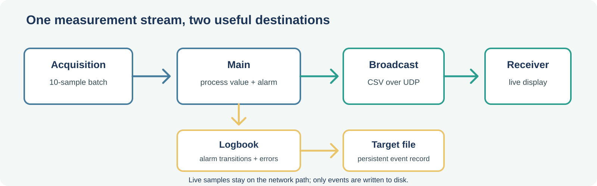

<!-- _class: lead -->
<!-- _backgroundColor: #1D3557 -->
<!-- _color: white -->

# 4️⃣ Session 4
## Broadcasting to whoever's listening

---

## Today's plan *(relative to your session start)*

| Elapsed | Block |
|---|---|
| 0:00–0:10 | Welcome, recap |
| 0:10–0:50 | Concept 1 — UDP, and the wire-format boundary |
| 0:50–2:00 | Work 1 — Build `Broadcast.lvlib`, wire it into Main |
| 2:00–2:15 | Break |
| 2:15–3:15 | Work 2 — A receiver that's never seen our project |
| 3:15–3:45 | Harden and consolidate |
| 3:45–4:00 | Wrap-up |

---

## 🔁 Recap

`ProcessDataBatch.vi` now turns every incoming batch into a **scalar value** and an **alarm** boolean — same shape for both teams, whatever the physics underneath. Main sends the live result to Broadcast and sends only alarm transitions and errors to Logbook.

Today, that result becomes visible **somewhere else entirely** — without Main ever knowing or caring who's watching.

---

<!-- _class: lead -->
<!-- _backgroundColor: #1D3557 -->
<!-- _color: white -->

# 🧩 Concept 1
## UDP, and the wire-format boundary

---

## What UDP actually promises

No handshake, no acknowledgment, no retransmission, no ordering guarantee.

For a live measurement broadcast, that's fine — a fresher datagram is always on its way. In exchange: **the sender doesn't need to know who's listening, or if anyone is.**

> An "order ready" screen. Nobody confirms you looked at it.

---

## Don't send your internal representation over the wire

`Message.ctl`'s `Variant` is great **inside** our app — every module here is LabVIEW, under our control.

The moment it leaves over UDP, that assumption breaks.

`BroadcastPayload.ctl = {timestamp: DBL, value: DBL, alarm: BOOL}` internally, but what goes out is a plain CSV string: `"<timestamp>,<value>,<alarm>"` — any tool on earth can parse that.

---

<!-- _class: lead -->
<!-- _backgroundColor: #1D3557 -->
<!-- _color: white -->

# 🛠️ Work 1
## Build Broadcast.lvlib, wire it into Main

---

## ✍️ Contract + front panel first

> *Can receive `"Stop"`, `"Publish"` (payload: `BroadcastPayload` as Variant). On `"Publish"`, format it to CSV, send it as one UDP datagram to a configured target. Never blocks, never expects a reply.*

**Front panel**: target IP (default `127.0.0.1` — keep it local for the classroom), target port

---

## 🛠️ Build it

Follow **the recipe from Session 2** — folder, `.lvlib`, copy the template `Handler.vi` in.

1. Branch `feature/broadcast-module`
2. On start, `UDP Open` (local port 0). Loop: `Dequeue`, timeout `−1`
3. On `"Publish"`: unflatten to `BroadcastPayload`, format to CSV, `UDP Write`
4. On `"Stop"`: `UDP Close`, exit
5. Build a `Module Tester.vi`, same pattern as Logbook's — **this one also needs its own `UDP Read`**, listening on the target port, so the tester can confirm what actually goes out on the wire without waiting for Work 2

✅ **Commit**: `"Broadcast module v1 — sends UDP datagrams (standalone)"`

---

## Wire it into Main

- Obtain Broadcast's queue, launch it in parallel
- After `ProcessDataBatch.vi` returns, build a `BroadcastPayload` (timestamp, value, alarm) and send `{"Publish", <payload>}`
- Log only alarm transitions and processing errors through Logbook; keep the live sample stream out of the file
- Extend the shutdown broadcast to Broadcast

✅ **Commit**: `"Wire Broadcast into Main"` — merge locally, push

---

<!-- _class: lead -->
<!-- _backgroundColor: #1D3557 -->
<!-- _color: white -->

# 🛠️ Work 2
## A receiver that's never seen our project

---

## Prove the decoupling is real

`/sandbox/receiver/Receiver.vi` — shares **zero** code, zero queues, zero knowledge of `Message.ctl` with our app. Only the CSV format.

1. `UDP Open`, listening on Broadcast's port
2. Loop: `UDP Read`, parse CSV, display on a chart
3. Run `Main.vi` + `Receiver.vi` side by side — watch data flow live

💡 **Quick sanity check, before or instead**: **"UDP - Sender/Receiver"**, a free Microsoft Store app — "Receive only" mode, same port. If a tool you didn't write, in a language you didn't choose, can read your datagrams, that's the decoupling claim proven for real.

✅ **Commit**: `"Standalone receiver demo — proves Broadcast decoupling"`

---

## 🔍 Harden and consolidate

We're at the halfway point — a good moment to firm things up.

- **Full run-through**: start, run, stop, close — no errors, no locked files
- **One quick note on Git & binary files**: working solo, real conflicts shouldn't happen — but `.vi`/`.lvlib` files can't be line-merged like text if you ever do self-conflict. One more reason small modules help.
- **Repo check**: `main` runs clean from a fresh pull

---

## 📦 Deliverables today

- `Broadcast.lvlib` (with `Module Tester.vi`) sending CSV UDP datagrams, wired into Main
- `Receiver.vi` in `/sandbox`, displaying live data with no shared code
- A full clean run confirmed, everything merged and pushed

---

<!-- _class: lead -->
<!-- _backgroundColor: #1D3557 -->
<!-- _color: white -->

## 🔜 Next week

Every number so far has been fake — a simulated accelerometer standing in for the real one.

*For anyone who wants to go further: we wire up an actual sensor.*
